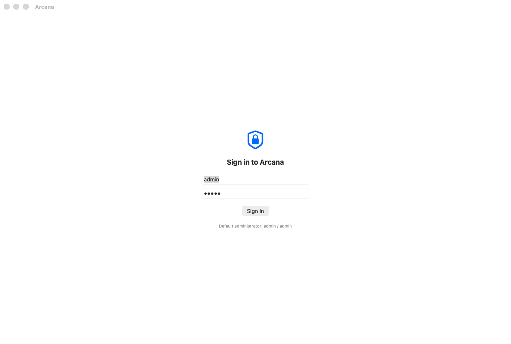
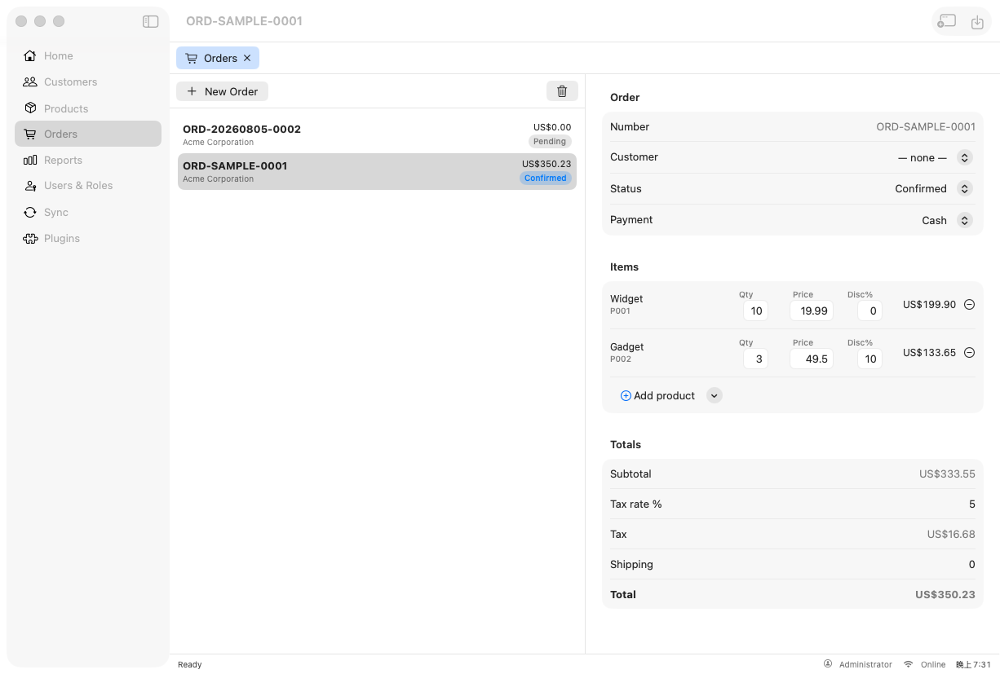
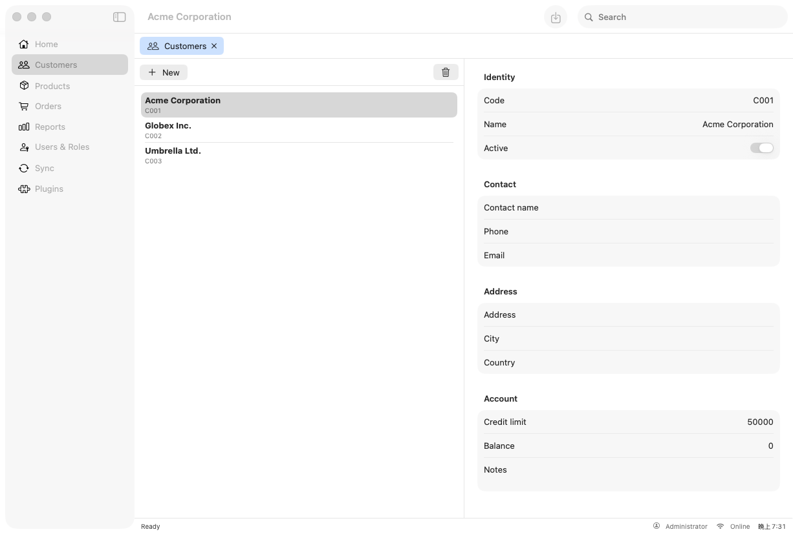
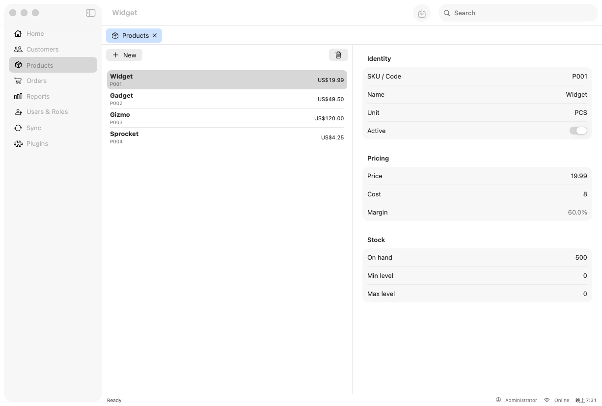
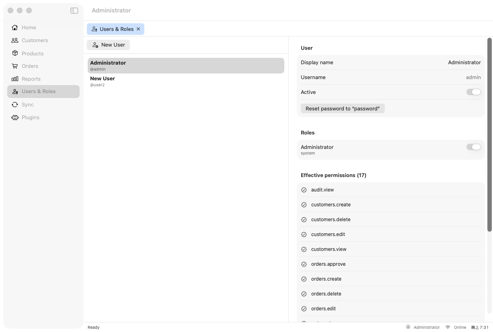
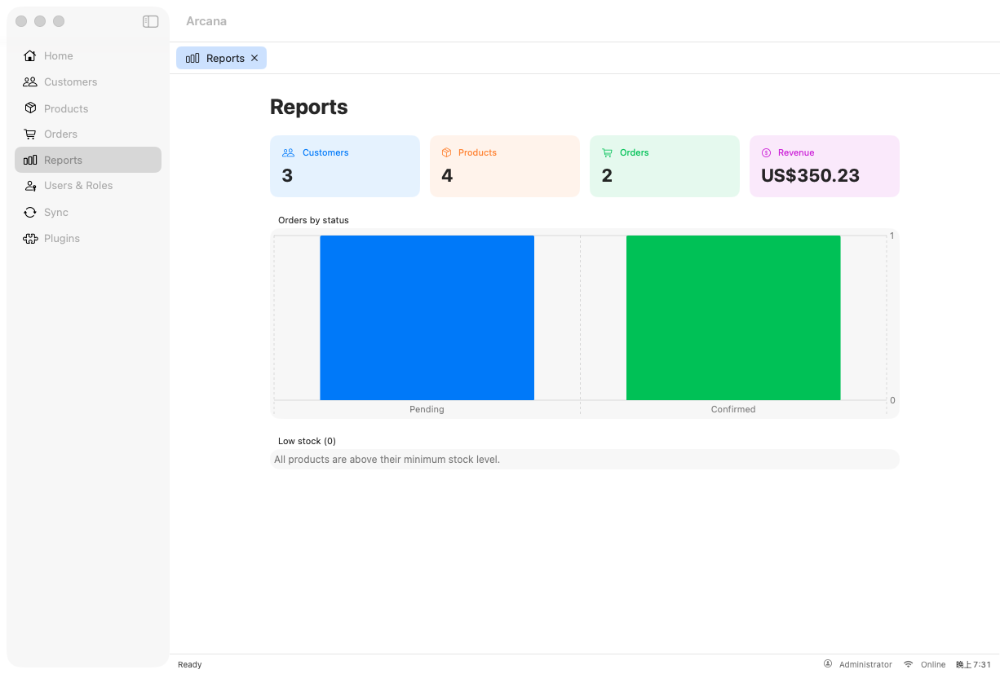
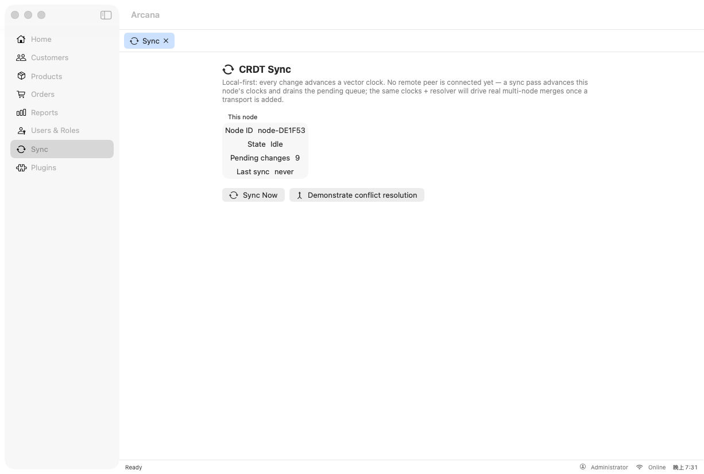
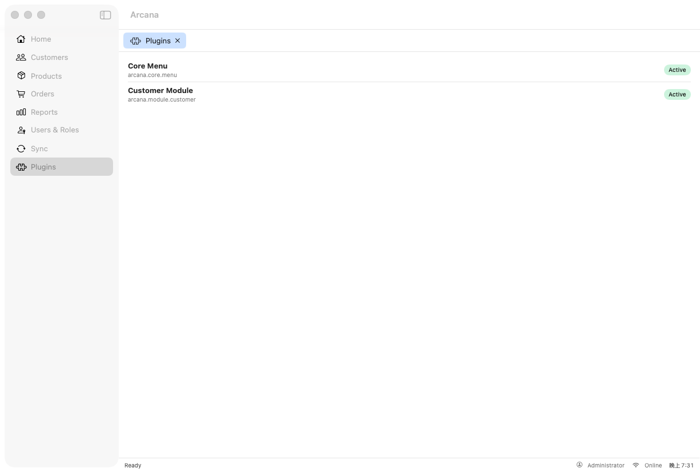

# arcana-macos

A **Local-First, Plugin-Everything macOS desktop application** — the Swift 6 / SwiftUI port of
[`arcana-windows`](https://github.com/jrjohn/arcana-windows) (WinUI 3 / .NET 10).

[](https://swift.org/)
[](https://www.apple.com/macos/)
[](https://developer.apple.com/xcode/swiftui/)
[]()
[]()
[]()

<p>
  <a href="https://arcana.boo/sonarqube/dashboard?id=arcana-macos"></a>
  <a href="https://arcana.boo/jenkins/job/macos-app-pipeline-mb/job/main/"></a>
  
</p>

Faithful architecture port: the CRDT sync engine, the VS Code-style plugin system, the desktop
shell, and the domain / identity / auth layers are all carried across to Swift 6, SwiftUI, and
SwiftData — and gated in CI by SonarQube + an architecture-conformance check.

---

## 📸 Screens

Real captures of the running app — a `NavigationSplitView` sidebar, document tabs, a dynamic main
menu built from plugin contributions, `MenuBarExtra`, a `Settings` scene, and a status bar.

| Sign-in gate (RBAC) | Orders — master-detail |
|:-:|:-:|
|  |  |

| Customers | Products |
|:-:|:-:|
|  |  |

| Users & Roles — RBAC admin | Reports |
|:-:|:-:|
|  |  |

| CRDT Sync | Plugins |
|:-:|:-:|
|  |  |

---

## 🏆 Architecture Evaluation

### Overall Grade: A− (8.4 / 10) ⭐⭐⭐⭐

A faithful, CI-gated architecture port. The engine rooms — CRDT sync, the plugin contribution
model, the domain/identity/auth layers — are ported and tested; the desktop shell and the core
feature screens are real and usable. The remaining work is breadth of feature UI and a remote
sync transport, not foundations.

#### ✅ Highlights
- ✅ **Swift 6 strict concurrency** (`.swiftLanguageMode(.v6)`) across every target — zero diagnostics
- ✅ **CRDT sync engine** (`ArcanaSync`) — VectorClock, LWW/MV registers, ConflictResolver — wired onto live data
- ✅ **VS Code-style plugin system** — 18 plugin types, contribution registries, message bus, permissions
- ✅ **RBAC + auth** — PBKDF2-SHA256, HMAC tokens in Keychain, permission resolver, real login + admin UI
- ✅ **Native shell** — `NavigationSplitView`, document tabs, dynamic menu, multi-window pop-out
- ✅ **Architecture gate** — `arch-qube` enforces module dependency direction (100%, 0 violations)
- ✅ **95 tests**, **SonarQube quality gate green at 87.5%** on the Mac mini CI agent

### 📊 Detailed Ratings

| Category | Score | Grade | Notes |
|---|---|---|---|
| **Clean Architecture** | 9.0 | A | Strict module layering, machine-enforced by `arch-qube` (0 violations) |
| **Modern Stack** | 9.5 | A+ | Swift 6 `.v6`, SwiftUI, SwiftData, CryptoKit, Swift Charts, Swift Testing |
| **CI / Quality Gates** | 9.0 | A | Jenkins on Mac mini, arch-qube 100%, SonarQube 87.5%, live & green |
| **CRDT Sync Engine** | 8.5 | A− | 5 CRDT types ported + wired to live data; **remote transport pending** |
| **Security / RBAC** | 8.5 | A− | PBKDF2 (100k), HMAC + Keychain, role-union/deny resolver, real login + admin |
| **Data Patterns** | 8.5 | A− | SwiftData `@Model`s, services, soft-delete, sync marking (no explicit UoW) |
| **Plugin System** | 8.0 | A− | Contracts + runtime + manager ported; **no dynamic load / management UI** |
| **Desktop Shell** | 8.0 | A− | Split-view + tabs + dynamic menu + pop-out windows; **no MDI nested tabs** |
| **Testing** | 8.5 | A− | 95 tests, 87.5% on tested modules, CI-gated (fewer than Windows' 507) |
| **MVVM Pattern** | 7.5 | B+ | Idiomatic SwiftUI `@Observable`; Input/Output/Effect partially applied |
| **Navigation** | 7.0 | B | Tab nav + command→bus routing; no full type-safe NavGraph yet |
| **Feature UI Breadth** | 7.0 | B | Real master-detail (Orders/Customers/Products) + Reports; ~70% overall |
| **Documentation** | 8.5 | A− | `PORT_STATUS`, `FEATURE_CHECKLIST`, `ARCHITECTURE`, per-commit notes |

### ✅ Strengths
- **Foundations are complete and tested**, not stubbed — the CRDT engine, plugin contribution
  model, and identity/auth layers all have real implementations and unit tests.
- **Machine-enforced architecture** — a CI gate fails the build on any cross-layer import, so the
  dependency direction can't rot.
- **Genuinely native** — SwiftUI/AppKit shell, SwiftData persistence, CryptoKit/Keychain, Swift
  Charts; no cross-platform shims on the product path.
- **Honest, gated quality** — SonarQube 87.5% coverage over the tested modules; ratings A/A/A.

### ❌ Gaps (largest remaining) — see [`docs/FEATURE_CHECKLIST.md`](docs/FEATURE_CHECKLIST.md)
| Area | Gap |
|---|---|
| **Remote sync** | No multi-node transport yet — sync is local-node only |
| **Feature breadth** | Product categories, per-module workflows, some detail flows |
| **Plugin management** | No install / enable-disable / permissions UI; no dynamic loading (macOS-forbidden by design) |
| **Cross-cutting UI** | Dialogs, file pickers, notifications, keyboard-shortcut binding |
| **Auth extras** | Account lockout, refresh-token rotation, MFA, external providers |
| **Packaging** | Xcode project + code-signing / notarization (only an ad-hoc `.app` today) |

### 🎯 Verdict

**Solid foundations, real screens, honest scope.** The architecture-critical subsystems are
ported and gated; the app runs, authenticates, and drives real master-detail feature screens.
What remains is feature-UI breadth and a sync server — clearly bounded, not foundational.

---

## 🧱 Module architecture

Dependency direction is enforced by [`scripts/arch-qube.sh`](scripts/arch-qube.sh); inner layers
never import outer ones (see [`ARCHITECTURE.md`](ARCHITECTURE.md)).

```
ArcanaMacApp (executable)
      │  launches
ArcanaShell ──────────────► ArcanaModel   (SwiftData domain / identity / auth)
  (SwiftUI shell) ─────────► ArcanaSync    (CRDT engine, zero-dependency)
        │
ArcanaPlugins ────────────► ArcanaPluginContracts
```

| Module | Role | Depends on |
|---|---|---|
| **ArcanaSync** | CRDT engine — VectorClock, LWW/MV registers, ConflictResolver, SyncService | — |
| **ArcanaPluginContracts** | Plugin contracts — `ArcanaPlugin`, contribution defs, message bus, permissions, manifest | — |
| **ArcanaPlugins** | Plugin runtime — registries, bus, permission manager, `PluginManager`, `CustomerModulePlugin` | ArcanaPluginContracts |
| **ArcanaModel** | Domain + identity + auth — SwiftData `@Model`s, services, PBKDF2/HMAC/Keychain, RBAC resolver, AuthService | — |
| **ArcanaShell** | macOS desktop shell + feature screens (Orders/Customers/Products/Users/Sync/Reports), theme/localization | Contracts, Plugins, Model, Sync |
| **ArcanaKit** | The iOS-derived Clean Architecture base carried over in P1 (not on the shell path) | swift-dependencies, Alamofire, LRUCache |
| **ArcanaMacApp** | Thin executable — `ArcanaShellApp.main()` | ArcanaKit, ArcanaShell |

### Subsystems
- **CRDT sync** — every entity carries a vector clock; a sync pass advances clocks and drains the
  pending queue; `ConflictResolver` offers LWW / FWW / field-merge / keep-both / custom strategies.
- **Plugin system** — plugins are static Swift modules that self-register and contribute
  menus/views/commands through registries; dependency-ordered activation with activation-event gating.
- **Security** — login → verify (PBKDF2) → resolve effective permissions (role union, then direct
  grant/deny with expiry) → session + audit log; HMAC token signing key lives in the Keychain.

---

## 🛠 Technology stack

| Concern | Windows (source) | macOS (this port) |
|---|---|---|
| Language | C# 14 / .NET 10 | **Swift 6** (`.swiftLanguageMode(.v6)`) |
| UI | WinUI 3 | **SwiftUI** + AppKit |
| Persistence | EF Core 10 (SQLite) | **SwiftData** |
| Crypto | `Rfc2898DeriveBytes`, HMACSHA256 | **CommonCrypto (PBKDF2)** + **CryptoKit (HMAC)** + **Keychain** |
| Charts | — | **Swift Charts** |
| Tests | xUnit (507) | **Swift Testing** (95) |
| CI | Jenkins | **Jenkins `macos-app-pipeline-mb`** (Mac mini agent) + SonarQube + arch-qube |

Requires Xcode 26+ / Swift 6.x, macOS 15+.

---

## 🚀 Build & run

```bash
swift build              # compile (Swift 6 strict concurrency)
swift test               # 95 tests (Swift Testing)
swift run ArcanaMacApp   # launch the shell (dev)
```

First launch shows the login screen — sign in with **admin / admin**. Sample customers, products,
and an order are seeded so the screens have content.

---

## ✅ CI & quality gates

The pipeline runs on the Mac mini agent (SwiftUI/SwiftData need a real macOS toolchain):

- **Build + 95 tests** green
- **arch-qube**: architecture-conformance gate — **0 violations (100%)**, with a self-test proving it isn't blind
- **SonarQube quality gate**: **PASSED** — coverage **87.5%** (≥ 80), reliability / security / maintainability **A / A / A**

See [`Jenkinsfile`](Jenkinsfile), [`sonar-project.properties`](sonar-project.properties),
[`docs/PORT_STATUS.md`](docs/PORT_STATUS.md), and [`docs/FEATURE_CHECKLIST.md`](docs/FEATURE_CHECKLIST.md).

---

## License

MIT (matching the Arcana fleet).
